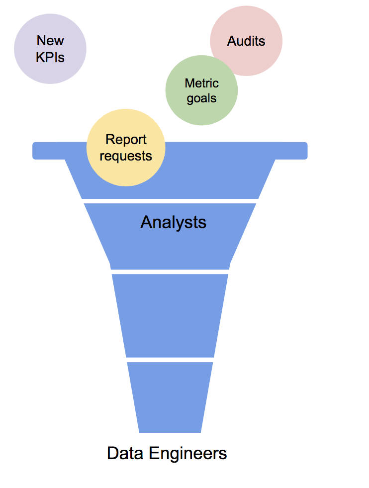

This post focuses on data engineers and their main stakeholders, whom I’m calling analysts. In some organizations, the main stakeholders may be data scientists or machine learning engineers, but the term analyst is not as bulky, so I’ll use that as a catch all. In addition, I’ll be using the term engineer to refer to data engineers, meaning any engineer who spends the bulk of his or her time focusing on data warehousing, ETL, or database management. 

What should the relationship be between engineers and analysts? Good. That is the TL;DR. You are done.

Okay I’ll explain more what I mean. At the three companies at which I’ve been a data engineer and the one at which I’ve been a data analyst, I can say that the data structure tends to look like this:

{:class="img-responsive"}{:height="400px"}

_Figure 1: The approximate relationship between analysts and engineers. I made this myself_

This diagram shows there is no superior and inferior group; the relationship is not a hierarchy, it’s a machine with two parts. It’s a  machine that, when it works, allows two sets of people with related but distinguishable sets of skills to help a company optimize its data usage. 

The diagram shows one other thing: the two teams need to trust each other. Any two individuals working together have to know that, while one focuses on one’s part, the other part is covered well. Data engineers trust that analysts are giving them well written, top priority requests and querying the data to the best of their ability; analysts have to trust that data engineers are giving them good data. The more we trust, the less we look at what the other part is doing, and the more efficient we become. 

So how do we do this build unity and trust? I am not suggesting you invite all the analysts to your monthly book club meeting; positive professional relationships can be cultivated more subtly than that. However, the book is Big Little Lies and the drink is Frose so, James, bring ice.

This is how I have seen data engineers cultivate a good relationship with analysts:  
  **Make them your #1 stakeholder**  
  **Help them with data QA**   
  **Focus on your mutual goal**

**Make them your #1 stakeholder**
I know, I know, we love all stakeholders equally. I really do believe all stakeholders bring something equal and individual to the company, but analysts are a special case. Referring back to the funnel, analysts can be seen as a combination of all other stakeholders; they funnel the top priorities from around the organization into requests. So prioritizing them is not special preference to one group, but rather special preference to already prioritized requests.

**Help them with data QA and maintenance**
You know what they say: fences make good neighbors, unless people start throwing bad data over them. 
We should help all groups with QA as is needed, but analysts are the only group that is not strictly one domain so they may need a little more help. Although we should always check that our data is reasonable and right against the source, when a marketing exec asks for marketing data, a reasonable assumption is that he or she knows it cold; our QA pales in comparison to their domain knowledge.
For general analyst groups though, they may not have the domain knowledge. They cover multiple subject areas and some are new to them. While an exec may have been working on a implementing a new project for months, the analysts might not hear about it until right before it goes live. So we should give them a little extra help with QA.

**Focus on your mutual goal**
This should be obvious from the diagram: we are working on the same goal (I am so proud of that diagram; I’m going to ask my mum if she’ll hang it on the fridge). The KPIs need to be defined, the reports need to be made, and we have to do this together. So focus on that in every conversion, especially the hard ones. Invitations to help interview potential team members or invitations to meetings demonstrate an inclusiveness that won’t go unnoticed. 

As for how analysts can build a positive relationship with data engineers, virtually the same three tips apply with small tweaks: 
  **Be sure you’re representing data engineers fairly**  
  **Help with data QA**  
  **Focus on your mutual goal**

The only change is here is number 1: be sure you’re representing data engineers fairly. An analyst may talk to multiple departments and execs in one day, while I often have no meetings after stand up. This leaves bad analyst groups with a tempting choice: constantly blame back office for anything not on time or gone wrong. Data engineers are frequently not there to defend themselves, so they’re an easy target.
But I advise analysts not to give in to temptation; if you saw the funnel in half, nobody wins, especially not the company. Also, my mother said there's no room on the fridge for the funnel because of my sister's wedding stuff.

